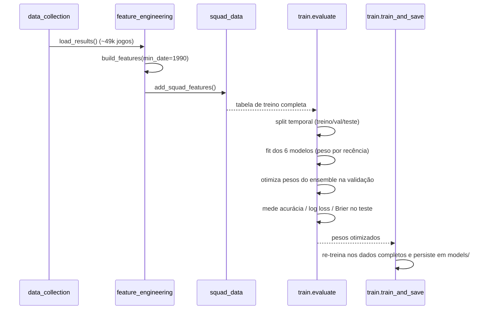
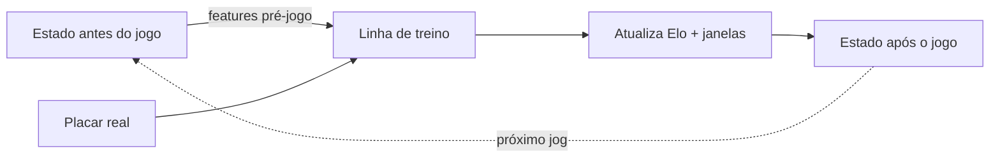
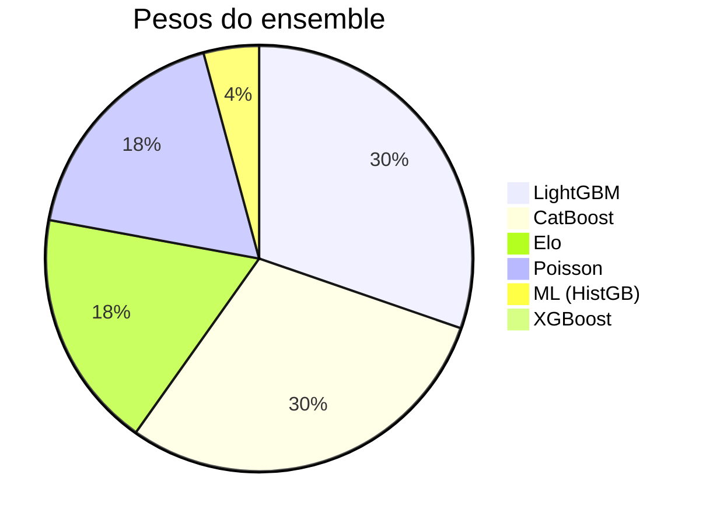
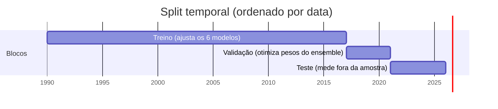
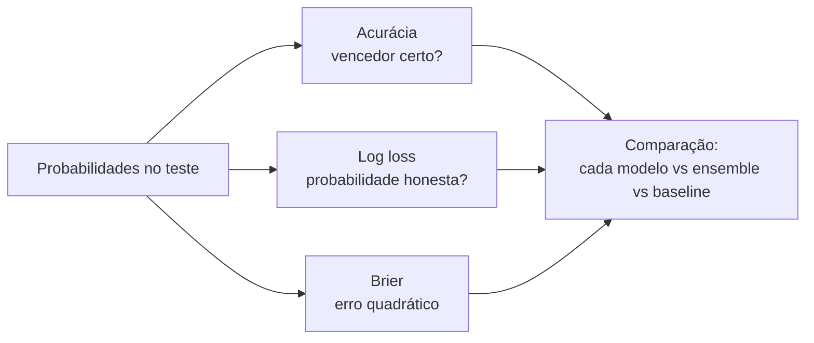

# Modelo de Previsão de Partidas de Seleções — Documentação Técnica Completa

> Documento didático com detalhes do sistema:
> arquitetura, matemática, features, validação, métricas, pontos fortes/fracos.
> Última revisão: 2026-06-20.

---

## Índice

1. [Visão geral e arquitetura](#1-visão-geral-e-arquitetura)
2. [Fontes de dados](#2-fontes-de-dados)
3. [Engenharia de features (sem vazamento)](#3-engenharia-de-features-sem-vazamento)
4. [Os 6 modelos](#4-os-6-modelos)
   - [4.1 Elo](#41-elo-eloprobmodel)
   - [4.2 Poisson / Dixon-Coles](#42-poisson--dixon-coles-poissonmodel)
   - [4.3 ML — HistGradientBoosting](#43-ml--histgradientboosting-mlmodel)
   - [4.4 CatBoost / LightGBM / XGBoost](#44-catboost--lightgbm--xgboost)
5. [Ensemble e otimização de pesos](#5-ensemble-e-otimização-de-pesos)
6. [Validação: split temporal, calibração e cross-validation](#6-validação-split-temporal-calibração-e-cross-validation)
7. [Métricas de avaliação](#7-métricas-de-avaliação)
8. [Decaimento temporal e janela histórica](#8-decaimento-temporal-e-janela-histórica)
9. [Pontos fortes e fracos (resumo)](#9-pontos-fortes-e-fracos-resumo)
10. [Glossário](#10-glossário)

---

## 1. Visão geral e arquitetura

O sistema prevê o resultado de um confronto entre duas seleções como uma
distribuição de probabilidade sobre **três classes**:

$$P(\text{resultado}) = \big[\, P(H),\ P(D),\ P(A) \,\big]$$

onde `H` = vitória do mandante (*home*), `D` = empate (*draw*), `A` = vitória do
visitante (*away*). Além disso, o modelo de Poisson produz o **placar mais
provável** e a distribuição completa de placares exatos.

A filosofia é um **ensemble de modelos heterogêneos**: cada modelo enxerga o
problema por um ângulo diferente (rating, ataque×defesa, padrões não-lineares).
Quando eles concordam, há confiança; quando divergem, é sinal de jogo incerto.

```mermaid
flowchart TD
    A[Dados crus] --> B[Engenharia de features<br/>feature_engineering.py]
    A2[Transfermarkt<br/>força de elenco] --> B
    B --> C[Tabela de treino<br/>+ team_state.json]
    C --> D1[Elo]
    C --> D2[Poisson / Dixon-Coles]
    C --> D3[ML HistGB]
    C --> D4[CatBoost]
    C --> D5[LightGBM]
    C --> D6[XGBoost]
    D1 --> E[Ensemble ponderado]
    D2 --> E
    D3 --> E
    D4 --> E
    D5 --> E
    D6 --> E
    E --> F[P(H), P(D), P(A)]
    D2 --> G[Placar mais provável<br/>+ distribuição de placares]
    F --> H[App Streamlit<br/>jogo único + Monte Carlo de torneio]
    G --> H
```

**Pipeline de treino** (`src/train.py → main()`):



---

## 2. Fontes de dados

| Fonte | Conteúdo | Licença | Atualização | Uso |
|---|---|---|---|---|
| **martj42/international_results** | ~49 mil partidas oficiais de seleções masculinas desde 1872 (placar, torneio, mando, campo neutro) | CC0 | De hora em hora | Base de tudo: Elo, forma, ataque/defesa |
| **dcaribou/transfermarkt-datasets** (`national_teams`) | Valor de mercado do elenco, idade média, ranking FIFA | CC0 | Snapshot estático (último: 2025) | Features de "força de elenco" |
| shootouts.csv | Vencedor de disputas de pênaltis | CC0 | — | Baixado, **não usado** nas features |

> **Honestidade científica:** o Transfermarkt é um *snapshot atual* (não
> histórico). O mesmo valor de elenco é aplicado a todas as partidas de uma
> seleção. Como o treino usa **decaimento temporal** (meia-vida de ~3 anos),
> só os jogos recentes pesam de fato — e para esses o snapshot é boa
> aproximação. Cobertura: 118 seleções; faltantes recebem `NaN` (tratado
> nativamente pelas árvores como "informação ausente").

---

## 3. Engenharia de features (sem vazamento)

Arquivo: `src/feature_engineering.py`. As partidas são processadas em **ordem
cronológica**, mantendo para cada seleção um **estado incremental** (`TeamState`).

### 3.1 O princípio do "sem vazamento" (no leakage)

Para cada partida o algoritmo:

1. **Lê** as features do estado *atual* das duas seleções → essas são as
   features **PRÉ-jogo** (só usam informação anterior à partida).
2. **Registra** a linha de treino com essas features + o resultado real.
3. **Só então** atualiza o Elo e as janelas de forma com o placar observado.



Isso garante que **nenhuma informação do futuro** (nem do próprio jogo) entra nas
features — condição essencial para que a avaliação seja honesta.

> **O que significa "sem vazamento"?** *Data leakage* é quando o modelo tem
> acesso, no treino, a informação que não estaria disponível no momento real da
> previsão. Aqui o pecado clássico seria calcular a "forma" incluindo o próprio
> jogo a prever. Registrando as features *antes* de atualizar o estado, isso é
> impossível por construção.

### 3.2 Rating Elo

Cada seleção começa com `ELO_START = 1500`. A expectativa de pontuação do
mandante (probabilidade de vitória + meio-empate) é a logística do Elo:

$$E_{\text{home}} = \frac{1}{1 + 10^{(R_{\text{away}} - R_{\text{home}} - H)/400}}$$

onde $H = 65$ (`HOME_ADVANTAGE`) só conta se o campo **não** for neutro. A
atualização após o jogo:

$$R_{\text{home}} \mathrel{+}= K \cdot \omega \cdot \gamma \cdot (S_{\text{home}} - E_{\text{home}})$$

- $K = 40$ (`ELO_K`) — velocidade de aprendizado.
- $\omega$ = peso por importância do torneio (`tournament_weight`): Copa do Mundo
  `1.00`, Euro/Copa América `0.90`, eliminatórias `0.75–0.85`, amistoso `0.45`.
- $\gamma$ = multiplicador por saldo de gols (modelo *World Football Elo*):
  $|\Delta| \le 1 \Rightarrow 1.0$; $|\Delta| = 2 \Rightarrow 1.5$;
  $|\Delta| \ge 3 \Rightarrow (11 + |\Delta|)/8$.
- $S_{\text{home}} \in \{1, 0.5, 0\}$ — pontuação real (vitória/empate/derrota).

O Elo do visitante recebe o **delta simétrico** (jogo de soma zero).

### 3.3 Janela de forma (últimos 10 jogos)

`FORM_WINDOW = 10`. Cada `TeamState` mantém *deques* de tamanho 10 com gols
pró/contra, pontos (3/1/0), Elo do oponente e datas. A partir deles:

| Feature | Definição | Intuição |
|---|---|---|
| `form` | $\sum \text{pontos} / (n \cdot 3)$ | aproveitamento simples em [0,1] |
| `attack` | média de gols **marcados** | poder ofensivo |
| `defense` | média de gols **sofridos** | solidez defensiva (menor = melhor) |
| `style` | `attack + defense` (gols totais/jogo) | ritmo / "tempo" de jogo |
| `aggression` | `attack − defense` (saldo médio) | perfil ofensivo(+)/defensivo(−) |

### 3.4 Features avançadas (engenharia v2)

| Feature | Fórmula / ideia | Por quê |
|---|---|---|
| `ewma_form` | EWMA dos pontos, meia-vida de **3 jogos** | dá mais peso aos jogos mais recentes da janela |
| `adj_attack` | EWMA de $\text{gols\_pró} \times f(\text{elo\_opp})$ | marcar contra time forte vale mais |
| `adj_defense` | EWMA de $\text{gols\_contra} / f(\text{elo\_opp})$ | sofrer contra time forte "pesa" menos |
| `sos` | $(\overline{\text{elo\_opp}} - 1500)/100$ | *strength of schedule*: força do calendário |
| `streak` | sequência com sinal (+vitórias / −derrotas) | momento psicológico |
| `rest_days` | dias desde o último jogo (teto 180) | fadiga / descanso |
| `window_days` | amplitude temporal da janela de 10 jogos | densidade do calendário |
| `games` | nº de jogos já disputados | confiabilidade das médias |

O fator de força do oponente é

$$f(\text{elo}) = \text{clip}\!\left(1 + \frac{\text{elo} - 1500}{600},\ 0.5,\ 1.7\right)$$

e o EWMA dentro da janela usa peso $0.5^{(\text{idade em jogos})/3}$.

### 3.5 Features de elenco (Transfermarkt)

Calculadas como **diferenças mandante − visitante** (`src/squad_data.py`):

- `squad_value_diff` = $\log(1+V_h) - \log(1+V_a)$ (valor de mercado, log para
  comprimir a cauda).
- `squad_age_diff` = idade média do elenco (mandante − visitante).
- `fifa_rank_diff` = `rank_away − rank_home` (positivo ⇒ mandante melhor
  ranqueado).

Valores de mercado ausentes são **imputados** por regressão log-linear sobre o
ranking FIFA: $\log(1+V) \approx a + b\cdot\log(1+\text{rank})$.

### 3.6 Resumo — todas as features do `MLModel`

```text
ML_FEATURES (15 base):
  elo_diff, elo_home, elo_away,
  home_form, away_form, home_attack, away_attack,
  home_defense, away_defense, home_style, away_style,
  home_aggression, away_aggression, neutral, importance

SQUAD_FEATURES (3):
  squad_value_diff, squad_age_diff, fifa_rank_diff

ADV_FEATURES (14):
  home_ewma_form, away_ewma_form, home_adj_attack, away_adj_attack,
  home_adj_defense, away_adj_defense, home_sos, away_sos,
  home_streak, away_streak, home_rest_days, away_rest_days,
  home_window_days, away_window_days

ML_ALL_FEATURES = 15 + 3 + 14 = 32 features
```

> O `elo_diff` já embute a vantagem de mando: `elo_home + HOME_ADVANTAGE − elo_away`
> (a vantagem zera em campo neutro).

---

## 4. Os 6 modelos

Todos implementam a mesma interface: `fit(df, sample_weight)` e
`predict_proba(feats) → [P(H), P(D), P(A)]`.

### 4.1 Elo (`EloProbModel`)

**O quê:** regressão logística multinomial usando apenas `elo_diff` e `neutral`
(padronizados com `StandardScaler`).

$$P(\text{classe}) = \text{softmax}(W \cdot x + b),\quad x = [\text{elo\_diff},\ \text{neutral}]$$

- **Algoritmo:** `LogisticRegression(max_iter=1000, C=1.0)`.
- **Features:** 2 (a diferença de Elo carrega quase toda a "força relativa").
- **Treino:** ponderado por recência (`sample_weight = temporal_weights`).
- **Pontos fortes:** robusto, pouquíssimos parâmetros, interpretável,
  excelente para captar força relativa de longo prazo.
- **Pontos fracos:** ignora forma recente, estilo e contexto; não produz placar.

### 4.2 Poisson / Dixon-Coles (`PoissonModel`)

**O quê:** modela os gols de cada lado como variáveis de Poisson e deriva
**todos** os resultados a partir da matriz de placares.

**Passo 1 — gols esperados (λ).** A partir das forças de ataque/defesa
normalizadas pela média da liga, com amortecimento e ajuste de Elo:

$$\lambda_h = b_h \cdot \left(\frac{\text{atk}_h}{\bar a}\right)^{d}\!\!\cdot \left(\frac{\text{def}_a}{\bar d}\right)^{d}\!\!\cdot 10^{\,\text{elo\_diff}/1000}$$

$$\lambda_a = b_a \cdot \left(\frac{\text{atk}_a}{\bar a}\right)^{d}\!\!\cdot \left(\frac{\text{def}_h}{\bar d}\right)^{d}\!\!\Big/ 10^{\,\text{elo\_diff}/1000}$$

- $b_h, b_a$ = média de gols mandante/visitante (estimadas no `fit`, ponderadas
  por recência).
- $d = 0.5$ (`damping`): suaviza extremos. Com $d=0.5$ a razão crua vira raiz
  quadrada, evitando superconfiança em janelas atípicas (ex.: defesa de 0,2
  gols).
- O ajuste de Elo dá ~±25% por 200 pontos. Por fim $\lambda \in [0.15, 6.0]$
  (sanidade).

**Passo 2 — matriz de placares (Poisson independente):**

$$M_{ij} = \frac{e^{-\lambda_h}\lambda_h^{\,i}}{i!} \cdot \frac{e^{-\lambda_a}\lambda_a^{\,j}}{j!},\quad i,j \in \{0,\dots,10\}$$

**Passo 3 — correção Dixon-Coles** nos placares baixos, onde o Poisson puro erra
(há dependência entre os gols em 0-0, 1-0, 0-1, 1-1):

$$
\begin{aligned}
M_{00} &\mathrel{*}= 1 - \lambda_h\lambda_a\rho, & M_{01} &\mathrel{*}= 1 + \lambda_h\rho,\\
M_{10} &\mathrel{*}= 1 + \lambda_a\rho, & M_{11} &\mathrel{*}= 1 - \rho.
\end{aligned}
$$

com $\rho = -0.08$ **fixo** (não estimado por máxima verossimilhança). Depois a
matriz é re-normalizada para somar 1.

**Passo 4 — probabilidades** por soma de regiões da matriz:

$$P(H) = \sum_{i>j} M_{ij},\quad P(D) = \sum_i M_{ii},\quad P(A) = \sum_{i<j} M_{ij}$$

O **placar mais provável** é $\arg\max_{i,j} M_{ij}$.

- **Pontos fortes:** modela explicitamente ataque×defesa; **gera placar
  provável** e probabilidade de cada resultado exato; base natural para mercados
  (over/under, ambos marcam).
- **Pontos fracos:** assume (quase) independência entre os gols; sensível a
  goleadas atípicas; o λ aqui é **heurístico** (derivado de janelas + Elo), não
  uma regressão de Poisson com ratings de ataque/defesa estimados por MLE; o
  $\rho$ é fixo em vez de ajustado aos dados.

### 4.3 ML — HistGradientBoosting (`MLModel`)

**O quê:** *gradient boosting* de árvores (histograma) sobre as **32 features**,
com **calibração** das probabilidades.

```mermaid
flowchart LR
    F[32 features] --> B[HistGradientBoostingClassifier<br/>max_iter=400, lr=0.05<br/>max_leaf_nodes=31, L2=1.0<br/>early_stopping]
    B --> C[CalibratedClassifierCV<br/>isotônica, cv=3]
    C --> P[P(H), P(D), P(A)]
```

- **Hiperparâmetros:** `max_iter=400`, `learning_rate=0.05`,
  `max_leaf_nodes=31`, `l2_regularization=1.0`, `early_stopping=True`
  (`validation_fraction=0.1`), `random_state=42`.
- **Calibração:** `CalibratedClassifierCV(method="isotonic", cv=3)` — ver §6.2.
- **NaN:** tratado nativamente pelas árvores (vira "informação ausente"),
  permitindo seleções sem cobertura de elenco.
- **Pontos fortes:** captura interações não-lineares (Elo × forma × estilo ×
  elenco); costuma **calibrar melhor** que os modelos lineares.
- **Pontos fracos:** "caixa-preta"; precisa de dados suficientes; risco de
  sobreajuste se mal regularizado.

### 4.4 CatBoost / LightGBM / XGBoost

Três implementações distintas de *gradient boosting* sobre o **mesmo conjunto de
32 features**, todas embrulhadas em `CalibratedClassifierCV(isotonic, cv=3)`. A
classe-base `_CalibratedBoost` padroniza o `fit`/`predict_proba`.

> Detalhe técnico: usam **rótulos inteiros** `{H:0, D:1, A:2}` porque o XGBoost
> não aceita rótulos string; o `predict_proba` reordena de volta para `[H, D, A]`.
> As features são passadas como `DataFrame` para preservar os nomes (evita
> *warnings* de *feature names* no LightGBM/XGBoost).

| Modelo | Configuração principal |
|---|---|
| **CatBoost** | `iterations=400, learning_rate=0.05, depth=6, l2_leaf_reg=3.0` |
| **LightGBM** | `n_estimators=400, lr=0.05, num_leaves=31, reg_lambda=1.0, subsample=0.8, colsample_bytree=0.8` |
| **XGBoost** | `n_estimators=400, lr=0.05, max_depth=6, reg_lambda=1.0, subsample=0.8, colsample_bytree=0.8, eval_metric=mlogloss` |

No backtest, os três juntos renderam ganho marginal mas consistente ao ensemble
(~+0.0016 em log loss). Na prática (ver pesos abaixo) **CatBoost e LightGBM
dominam**, enquanto XGBoost acaba com peso ~0.

---

## 5. Ensemble e otimização de pesos

O ensemble é a **média ponderada** das probabilidades dos modelos, re-normalizada:

$$P_{\text{ens}} = \frac{\sum_m w_m \, P_m}{\sum_m w_m},\qquad \sum_m w_m = 1,\ w_m \ge 0$$

Os pesos $w_m$ são encontrados **na partição de validação** minimizando o log
loss, por otimização com restrições (simplex):

$$w^\star = \arg\min_{w \in \Delta} \ \text{LogLoss}\big(y_{\text{val}},\ \textstyle\sum_m w_m P_m\big)$$

Implementação: `scipy.optimize.minimize(method="SLSQP")` com `bounds=[0,1]` e a
restrição de igualdade $\sum w = 1$ (`optimize_weights` em `src/train.py`).

**Pesos atuais** (`models/ensemble_weights.json`):

| Modelo | Peso |
|---|---|
| LightGBM | 0.303 |
| CatBoost | 0.295 |
| Elo | 0.181 |
| Poisson | 0.179 |
| ML (HistGB) | 0.042 |
| XGBoost | ~0.000 |



> **Leitura:** os *boostings* (CatBoost+LightGBM ≈ 60%) carregam o sinal
> não-linear; Elo e Poisson contribuem com visões complementares
> (força de longo prazo e ataque×defesa). O XGBoost é redundante dado os outros
> dois boostings — por isso o otimizador o zera. Esse é o **valor de um ensemble
> bem calibrado:** ele descarta sozinho o que não agrega.

### 5.1 Divergência (sinal de incerteza)

O objeto `Prediction` também reporta:

- `diverges` — `True` se os modelos não concordam sobre o vencedor mais provável.
- `disagreement` — dispersão máxima entre os modelos
  ($\max_k \max_m P_{m,k} - \min_m P_{m,k}$).

Útil para sinalizar jogos "imprevisíveis" ao usuário.

---

## 6. Validação: split temporal, calibração e cross-validation

### 6.1 Split temporal em 3 blocos (sem embaralhar!)

Como os dados são uma **série temporal**, *nunca* se embaralha. A divisão é
cronológica (`evaluate`, `test_fraction=0.15`, `val_fraction=0.15`):



- **Treino** (~1990→2017): ajusta os 6 modelos, com peso por recência.
- **Validação** (~2017→2021): otimiza os pesos do ensemble (minimiza log loss).
- **Teste** (~2021→2026, ~4.848 jogos): mede o desempenho final, **fora da
  amostra**.

Esse desenho impede que o ajuste dos pesos "veja" o conjunto de teste — cada
bloco serve a um propósito e nenhum dado do futuro contamina o passado.

### 6.2 Cross-validation: onde ela é usada

A cross-validation entra **dentro da calibração**, não no split principal (que é
temporal por necessidade):

- Todos os modelos de árvore (`ML`, `CatBoost`, `LightGBM`, `XGBoost`) usam
  `CalibratedClassifierCV(method="isotonic", cv=3)`.
- Isso faz uma **validação cruzada em 3 dobras**: o classificador-base é treinado
  em 2/3 e a curva de calibração (regressão **isotônica**, monotônica
  não-paramétrica) é ajustada no 1/3 retido, repetindo 3×.
- **Por quê calibrar?** Um boosting pode acertar o *ranking* das classes mas
  produzir probabilidades mal-escaladas (ex.: dizer "70%" quando o real é 55%).
  A calibração isotônica corrige isso para que "70%" signifique de fato 70% —
  essencial porque otimizamos e reportamos **log loss/Brier**, que punem
  probabilidades mal calibradas.

> Resumo: **split temporal** para honestidade fora-da-amostra + **CV de 3 dobras**
> para calibrar probabilidades. As duas coisas coexistem em níveis diferentes.

### 6.3 Treino final

Após o backtest, `train_and_save` **re-treina nos dados completos** (todo o
histórico desde 1990, com peso por recência) e persiste os 6 modelos + os pesos
do ensemble em `models/`. Ou seja: o backtest mede a qualidade; o modelo
entregue usa todos os dados disponíveis.

---

## 7. Métricas de avaliação

Reportadas por modelo, pelo ensemble (média e pesos) e por um baseline.

| Métrica | Fórmula | O que mede | Melhor |
|---|---|---|---|
| **Acurácia** | $\frac{1}{N}\sum \mathbf{1}[\hat y = y]$ | acerto do vencedor | maior |
| **Log loss** | $-\frac{1}{N}\sum_i \sum_k y_{ik}\log p_{ik}$ | qualidade probabilística (pune confiança errada) | menor |
| **Brier** | $\frac{1}{N}\sum_i \sum_k (p_{ik} - y_{ik})^2$ | erro quadrático das probabilidades | menor |

- **Baseline:** prever sempre a classe majoritária (mando vence). Serve de piso —
  qualquer modelo útil precisa superá-lo.
- **Por que log loss é a métrica-rainha?** Porque o produto final é uma
  *probabilidade*, não um palpite binário. Log loss penaliza fortemente dizer
  "90%" e errar — exatamente o comportamento que queremos desencorajar. Por isso
  os pesos do ensemble são otimizados em log loss.



---

## 8. Decaimento temporal e janela histórica

Dois mecanismos controlam **o quanto o passado importa**:

### 8.1 Peso por recência (no `fit` de todos os modelos)

Cada jogo de treino recebe um peso exponencial pela idade:

$$w(\text{jogo}) = 0.5^{\,\text{idade\_em\_dias} / H},\qquad H = 365 \times 3 \approx 3\text{ anos}$$

Ou seja, um jogo de **3 anos atrás pesa metade** de um jogo de hoje; de 6 anos,
um quarto; e assim por diante. Equilibra recência (relevância) e volume
(estabilidade estatística).

### 8.2 Corte histórico (`min_date = 1990-01-01`)

`build_features` descarta como **linha de treino** tudo antes de 1990, mas
**mantém o histórico anterior para "aquecer" o Elo** (para que os ratings de 1990
já sejam realistas, não 1500 chapado). Assim:

- Pré-1990: só alimenta o Elo (warm-up), não vira exemplo de treino.
- 1990→hoje: vira exemplo de treino, com peso por recência.

> **Por que não treinar com tudo desde 1872?** Futebol de seleção dos anos 1900
> tem regras, calendário e nível atléticos muito diferentes; esses jogos
> "envenenariam" o aprendizado. O corte em 1990 + a meia-vida de 3 anos focam o
> modelo no futebol moderno sem jogar fora o histórico que estabiliza o Elo.

---

## 9. Pontos fortes e fracos (resumo)

| Modelo | Pontos fortes | Pontos fracos |
|---|---|---|
| **Elo** | robusto, interpretável, ótimo para força relativa de longo prazo | ignora forma/estilo/contexto; não dá placar |
| **Poisson/Dixon-Coles** | ataque×defesa explícito; **gera placar** e resultados exatos; base para mercados | independência dos gols; λ heurístico (não MLE); ρ fixo |
| **ML (HistGB)** | interações não-lineares; trata NaN; boa calibração | caixa-preta; precisa de dados |
| **CatBoost/LightGBM** | melhor sinal não-linear (dominam o ensemble) | caixa-preta; custo de treino |
| **XGBoost** | bom isoladamente | redundante aqui (peso ~0) |
| **Ensemble** | combina visões; otimiza pesos por log loss; sinaliza divergência | herda limites das fontes de dados (snapshot de elenco; sem xG) |

**Limitações do sistema como um todo (honestas):**

- Sem dados de eventos (xG, chutes, escanteios) para seleções de forma contínua —
  só placar. Logo, "qualidade de criação de chances" não é capturada.
- Valor de elenco é *snapshot* (mitigado pelo decaimento temporal).
- Poisson com λ heurístico e ρ fixo — há espaço para uma regressão de Poisson
  com ataque/defesa por MLE e ρ estimado.
- O modelo prevê os **90 minutos**; disputas de pênaltis (mata-mata) não entram
  nas features.

---

## 10. Glossário

- **Elo:** sistema de rating relativo; diferença de pontos ⇒ probabilidade de
  vitória via logística.
- **Poisson:** distribuição de contagem; modela "número de gols" dado um λ médio.
- **Dixon-Coles:** correção do Poisson independente para placares baixos
  (dependência entre os gols).
- **Gradient boosting:** ensemble sequencial de árvores onde cada árvore corrige
  o erro da anterior.
- **Calibração isotônica:** ajuste monotônico que transforma *scores* em
  probabilidades fiéis à frequência real.
- **Cross-validation (k-fold):** divide os dados em k partes, treina em k−1 e
  valida na restante, repetindo k vezes.
- **Log loss / cross-entropy:** $-\sum y\log p$; pune previsões confiantes e
  erradas.
- **Brier score:** erro quadrático médio das probabilidades.
- **EWMA:** média móvel exponencialmente ponderada (recente pesa mais).
- **SOS (*strength of schedule*):** força média dos adversários enfrentados.
- **Data leakage:** uso indevido de informação do futuro no treino.
- **Decaimento temporal:** ponderar jogos antigos com peso menor.

---

### Mapa dos arquivos

| Arquivo | Responsabilidade |
|---|---|
| `src/data_collection.py` | baixa `results.csv`/`shootouts.csv` (martj42) |
| `src/feature_engineering.py` | Elo, janelas, features avançadas, `team_state.json` |
| `src/squad_data.py` | força de elenco (Transfermarkt), imputação, diffs |
| `src/models.py` | os 6 modelos + `combine` (ensemble) |
| `src/train.py` | split temporal, backtest, otimização de pesos, persistência |
| `app.py` | interface Streamlit (jogo único + Monte Carlo de torneio) |
| `models/*.joblib` + `ensemble_weights.json` | modelos treinados + pesos |
